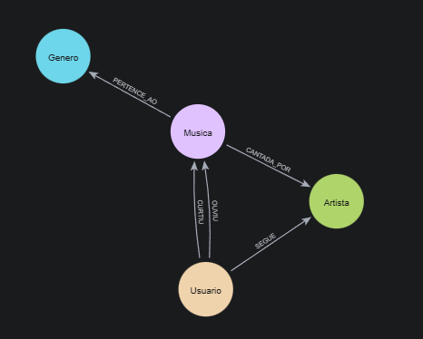
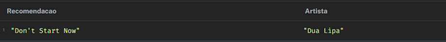
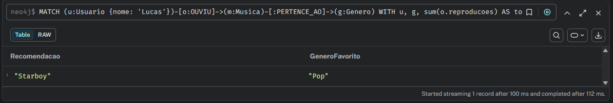

# Sistema de Recomendação de Músicas com Neo4j

Este projeto é um desafio prático de banco de dados em grafos da DIO. O objetivo é modelar e implementar um sistema de recomendação musical utilizando o Neo4j e a linguagem Cypher.

## 🎵 Contexto do Problema
Com o volume massivo de músicas disponíveis nas plataformas de streaming, ajudar o usuário a descobrir novas faixas que combinem com seu gosto é essencial para a retenção. 

**Por que usar Grafos?**
Bancos de dados relacionais sofrem com problemas de performance ao realizar múltiplos `JOINs` para mapear conexões complexas (ex: "Amigos de usuários que ouviram a música X do gênero Y"). O Neo4j trata as relações como entidades de primeira classe, permitindo consultas de recomendação (filtros colaborativos e baseados em conteúdo) em tempo real e com alta performance.

## 📊 Modelo do Grafo
Abaixo está a representação visual do nosso esquema, gerada a partir do banco de dados:

- **Nós:** `Usuario`, `Musica`, `Artista`, `Genero`
- **Relacionamentos:** `OUVIU`, `CURTIU`, `SEGUE`, `CANTADA_POR`, `PERTENCE_AO`

## ⚙️ Como Executar
1. Instale o [Neo4j Desktop](https://neo4j.com/download/) ou utilize o Neo4j AuraDB.
2. Inicie uma nova base de dados.
3. Copie o conteúdo do arquivo `dataset_carga.cypher` (disponível neste repositório) e cole no Neo4j Browser para criar a massa de dados inicial.
4. Execute as queries disponíveis em `queries_recomendacao.cypher` para testar os algoritmos.

## 🧠 Queries de Negócio e Insights

**1. Filtro Colaborativo:** Recomenda músicas com base em usuários com gostos similares.

**2. Recomendação por Conteúdo:** Sugere faixas de artistas que o usuário já segue, mas ainda não escutou.

**3. Descoberta por Gênero:** Identifica o gênero mais ouvido pelo usuário e sugere hits desse estilo que ele não conhece.

1. **Filtro Colaborativo:** Recomenda músicas com base em usuários com gostos similares.
2. **Recomendação por Conteúdo:** Sugere faixas de artistas que o usuário já segue, mas ainda não escutou.
3. **Descoberta por Gênero:** Identifica o gênero mais ouvido pelo usuário e sugere hits desse estilo.

## 🛠️ Troubleshooting (Dificuldades Encontradas)
* **Duplicação de Dados:** Durante a carga, utilizei `CREATE` e percebi dados duplicados ao rodar o script mais de uma vez. Resolvi aplicando o comando `MERGE` em conjunto com a definição explícita de propriedades únicas para garantir a idempotência do script.
